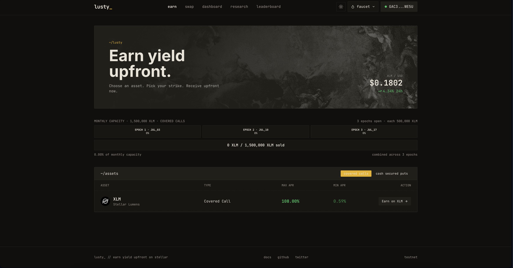
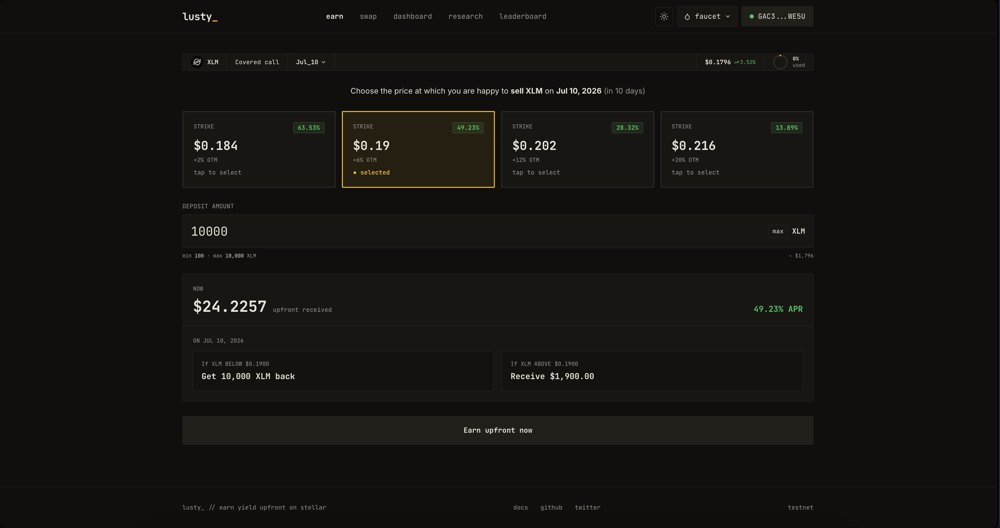
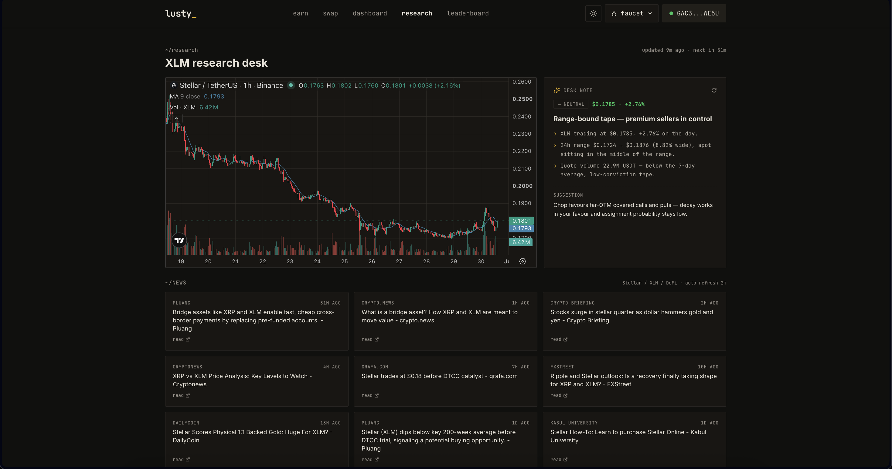

# Lusty

Sell covered calls and cash-secured puts on XLM. The premium hits your wallet
the moment you deposit. At expiry, settlement runs against an oracle price.

**Network:** Stellar Testnet · **Live:** [lusty.finance](https://lusty.finance) · **Demo:** [2-min walkthrough](https://www.youtube.com/watch?v=mkML5AbZLdg)

---

## Demo

[](https://www.youtube.com/watch?v=mkML5AbZLdg)

A two-minute walkthrough: connect a wallet, quote a covered call, deposit and
receive the premium instantly, then settle against the Reflector oracle.

## Screens

**Earn** — pick an asset, see live capacity across three rolling epochs.



**Strike selector** — choose a strike, see the upfront premium and the exact
payoff at expiry before depositing.



**Research desk** — live XLM tape, an auto-refreshing desk note, and a news
feed, all feeding the same volatility inputs the quote engine uses.



---

## Where Lusty is today

The protocol runs on two rails that share one pricing engine and one oracle.

The web vault is the production testnet app. It runs on Stellar Classic: a
protocol distributor account holds collateral and the server pays premiums.
This rail is custodial on purpose while the contract rail matures. Settlement
prices come from the Reflector oracle, pinned to the expiry timestamp.

The Soroban vault is the trustless rail, deployed on testnet. The contract
escrows collateral, pays the premium inside the same `deposit()` transaction,
and settles permissionlessly against Reflector at the expiry price. Real ITM
and OTM positions have been opened and settled end to end on testnet. Details
in [`contracts/README.md`](contracts/README.md).

Tranche 2 covers what remains of the migration: pointing the web app's deposit
flow at the contract, in-contract cash-secured puts, and an independent audit.
Custody is the only trust assumption left. Pricing and settlement already run
on the same oracle on both rails.

LUSD is a testnet convenience token, faucet-issued and unbacked, and the app
says so. It has no mainnet path. Mainnet settles in Circle's native USDC,
which the contract rail already supports.

## How a position works

1. Pick a strike and expiry. Expiries are rolling Fridays, three open at a
   time.
2. Deposit collateral: XLM for covered calls, cash for puts. The premium lands
   in your wallet immediately, and the quoted number is the paid number.
3. At expiry, settlement reads the oracle price at the expiry timestamp, so
   when you claim cannot change the outcome. For a covered call, spot at or
   below the strike returns your collateral whole; spot above the strike means
   assignment and you receive the strike value in cash. Puts mirror this.
4. You keep the premium in every case.

## Pricing

One quote engine (`src/lib/pricing-server.ts`) prices everything the UI shows
and everything the vault pays. There is no second adjustment layer.

```
σ_realized  ← XLM price history (EWMA, RiskMetrics λ=0.94)
σ_offered   = σ_realized × 1.10 + 0.03        vol risk premium, capped at 100%
F           ← forward from perp funding        (≈ spot for weeklies)
P_fair      = Black-76(side, F, K, T, σ_offered)
APR ladder  : nearest strike pinned to a time-scaled ceiling (120% × days/ref),
              farther strikes fall away on the Black-76 gradient
× taper     : offered APR falls linearly with pool utilization (−50% at full)
− fee       : 10% of the upfront, taken from the premium (never collateral)
```

Unit tests enforce two invariants. The user is never paid above the haircut
fair value, so the protocol keeps at least a 20% edge against its own Black-76
estimate. And no strike, including off-ladder ones a client might submit, can
quote above the displayed ceiling.

## Architecture

| Layer | Tech |
|-------|------|
| Frontend | Next.js 14, React 18, TypeScript, Tailwind |
| Wallets | Stellar Wallets Kit (Freighter, xBull, Albedo, Lobstr) |
| Settlement oracle | Reflector, on both rails: Soroban RPC simulation server-side, cross-contract call on-chain |
| Contracts | Soroban (Rust), `contracts/vault` |
| Web settlement | Stellar Classic payments from the distributor |
| Quote inputs | Binance (realized vol history, perp funding). Quote inputs only, never the settlement price |
| Database | PostgreSQL (Supabase), deny-all RLS |

## Testnet addresses

```
Soroban vault v2     CASVHBJ7MOZ5YFSVAYXKZFWIYAR6Y3Q4JI2P6GGJMRFUJBZN6APTZEZD
Reflector oracle     CCYOZJCOPG34LLQQ7N24YXBM7LL62R7ONMZ3G6WZAAYPB5OYKOMJRN63
LUSD issuer          GBCMRD6NDL2RAJUOFQ25EHZVO3IRIGNESWE4QDRFB4AVFIP7IT5BRCJ6
LUSD distributor     GBAIN6CHZJGBL365JNXSRQEKALXYTWKXANQZ3RBM7AGUEYYKLJJ6SNR6
```

## Security

The security model was rebuilt after the SCF #43 panel review. Each item below
can be checked against the commit history, and most are covered by tests.

- Premiums are recomputed server side from the quote engine. At claim time the
  strike, expiry, type and collateral come from the deposit record, never from
  the client.
- Settlement is pinned to the Reflector price at expiry, so claim timing gives
  the writer no optionality. The Binance kline at expiry is only a fallback.
- A database ledger with unique constraints blocks replays on deposit, claim
  and swap. It also blocks cross-endpoint reuse: one on-chain payment can fund
  a deposit or a swap, not both.
- Capacity caps (per user over 30 days, per user per expiry, per strike,
  per expiry) are checked and reserved in a single advisory-locked database
  transaction, so concurrent requests cannot overshoot them.
- Operations fail closed. If the price feed, the database, the breaker state
  or the oracle is unavailable or stale, the request is refused.
- A circuit breaker halts deposits on a volatility spike (3x the daily
  baseline), on oracle stress (a 10% one-minute move or an unreachable feed),
  and when a per-epoch loss cap is hit. A manual trip can only be cleared by
  a human.
- The issuer account requires 2-of-3 signatures for every operation, including
  minting. The distributor stays hot for payments, bounded by the caps above,
  and needs 2-of-3 for signer or threshold changes.
- 48 unit tests cover the pricing path; writing them caught a real CDF scaling
  bug in the Black-76 code. The Soroban contract has 17 more, including a mock
  oracle.
- Rate limiting, parameterized SQL, wallet-signature admin auth, CSP and HSTS
  headers.

## Project structure

```
contracts/
  vault/               Soroban covered-call vault (escrow + premium + settlement)
src/
  app/
    earn/              Strike selector, deposit, instant premium
    (app)/dashboard/   Positions & claims
    swap/  leaderboard/  docs/  (app)/research/
    api/
      vault/{quote,deposit,claim,positions,stats}
      swap/  faucet/lusd/  leaderboard/  admin/  cron/monitor/
  lib/
    pricing-server.ts  The quote engine (Black-76 + ladder + taper + fee)
    pricing.ts         Black-76 / CDF primitives, strike ladders
    vol.ts forward.ts  Realized vol (EWMA), perp-funding forward
    reflector.ts       Reflector reads via Soroban RPC (settlement source)
    deposit-capacity.ts Atomic cap checks + pending-row reservation
    idempotency.ts     Replay ledger (deposit/claim/swap)
    circuit-breaker.ts monitor/  Risk halts & alerting
    db.ts db-queries.ts vault-state.ts expiries.ts
  components/  hooks/  providers/
```

## Running locally

```sh
npm install
npm run dev        # web app on :3000 (.env.local required)
npm test           # pricing test suite
cd contracts && cargo test && stellar contract build
```

## License

MIT

