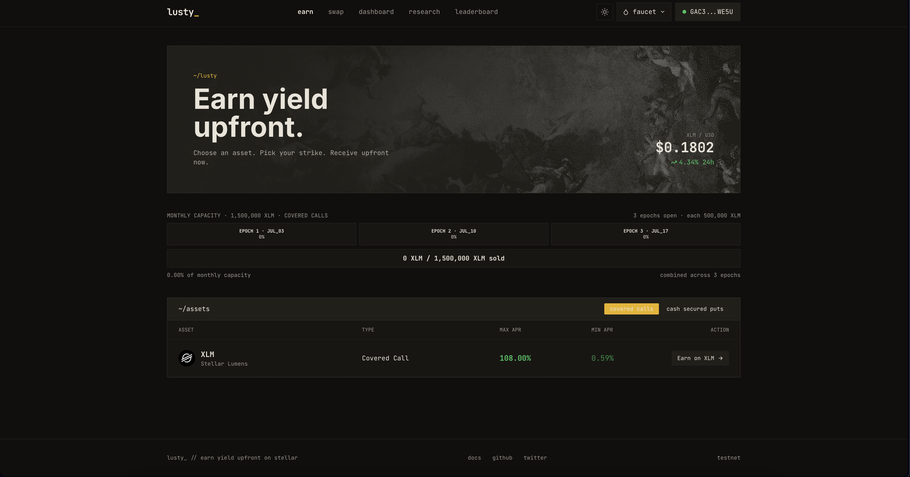
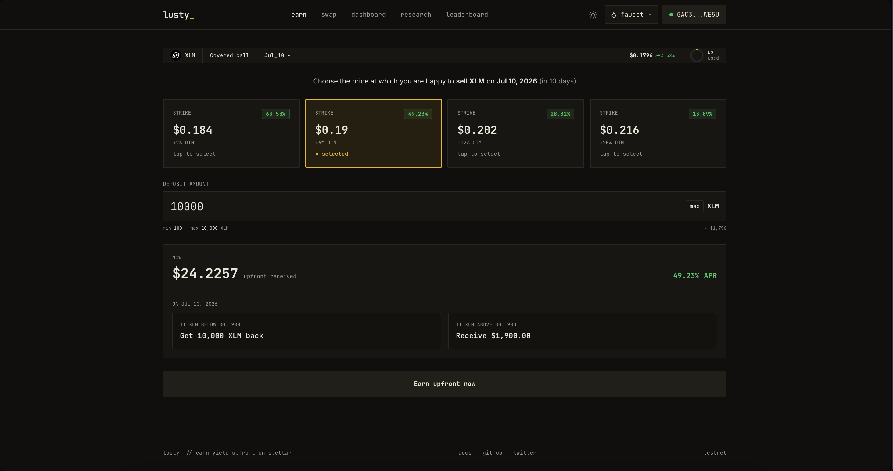
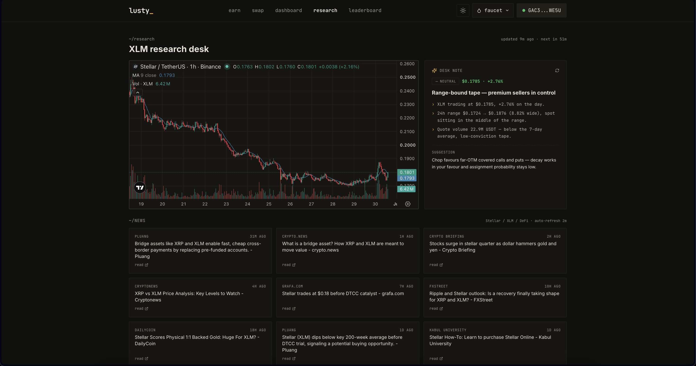

# Lusty

Sell covered calls and cash-secured puts on XLM. The premium hits your wallet
the moment you deposit. At expiry, settlement runs against an oracle price.

**Network:** Stellar Testnet · **Live:** [lusty.finance](https://lusty.finance) · **Demo:** [2-min walkthrough](https://www.youtube.com/watch?v=mkML5AbZLdg)

---

## Demo

[](https://www.youtube.com/watch?v=mkML5AbZLdg)

A two-minute walkthrough: connect a wallet, quote a covered call, deposit and
receive the premium instantly, then settle against the Reflector oracle.

## Screens

**Earn** — pick an asset, see live capacity across three rolling epochs.



**Strike selector** — choose a strike, see the upfront premium and the exact
payoff at expiry before depositing.



**Research desk** — live XLM tape, an auto-refreshing desk note, and a news
feed, all feeding the same volatility inputs the quote engine uses.



---

## Where Lusty is today

Collateral lives in the Soroban vault contract. The web app is a front end to
it, not a second rail: the earn flow opens positions through `open()`, which
escrows the collateral and pays the premium in one atomic transaction, and
anyone can call `settle()` against the Reflector price pinned to the expiry
timestamp. Real ITM and OTM positions have been opened and settled end to end
on testnet, including settlement driven from an unrelated third-party account.
Details in [`contracts/README.md`](contracts/README.md).

The custodial rail is retired. No operational account holds option collateral
or pays premiums; the LUSD distributor now backs only the testnet faucet and
the swap desk. What the server still holds is the quoter key, which co-signs
the premium on every `open()` and can do nothing else — it cannot move
collateral, settle, or change a position once opened, and the contract caps
every premium it may sign at `max_premium_bps` of the collateral behind it.

Tranche 2 covers what remains: putting quoter administration behind a multisig,
a scheduled runner that settles expired positions, and an independent audit.

LUSD is a testnet convenience token, faucet-issued and unbacked, and the app
says so. It has no mainnet path. Mainnet settles in Circle's native USDC,
which the contract already supports.

## How a position works

1. Pick a strike and expiry. Expiries are rolling Fridays, three open at a
   time.
2. Deposit collateral: XLM for covered calls, cash for puts. The premium lands
   in your wallet immediately, and the quoted number is the paid number.
3. At expiry, settlement reads the oracle price at the expiry timestamp, so
   when it settles cannot change the outcome. For a covered call, spot at or
   below the strike returns your collateral whole; spot above the strike means
   assignment and you receive the strike value in cash. Puts mirror this.
4. You keep the premium in every case.

## Pricing

One quote engine (`src/lib/pricing-server.ts`) prices everything the UI shows
and everything the vault pays. There is no second adjustment layer.

```
σ_realized  ← XLM price history (EWMA, RiskMetrics λ=0.94)
σ_offered   = σ_realized × 1.10 + 0.03         vol risk premium, capped at 100%
σ_strike    = σ_offered × ψ(z)                 per-strike vol off the smile,
                                               z = ln(K/F) / (σ_offered·√T)
F           ← forward from perp funding        (≈ spot for weeklies)
P_fair      = Black-76(side, F, K, T, σ_strike)
APR ladder  : nearest strike pinned to a time-scaled ceiling (120% × days/ref),
              farther strikes fall away on the Black-76 gradient
× taper     : offered APR falls linearly with pool utilization (−50% at full)
− fee       : 10% of the upfront, taken from the premium (never collateral)
```

The smile shape ψ is fitted to a live options surface rather than invented, and
σ_offered stays the anchor that sets the level, so the smile cannot feed back on
itself.

Unit tests enforce two invariants. The user is never paid above the haircut
fair value, so the protocol keeps at least a 20% edge against its own Black-76
estimate. And no strike, including off-ladder ones a client might submit, can
quote above the displayed ceiling.

## Architecture

| Layer | Tech |
|-------|------|
| Frontend | Next.js 14, React 18, TypeScript, Tailwind |
| Wallets | Stellar Wallets Kit (Freighter, xBull, Albedo, Lobstr) |
| Settlement oracle | Reflector: cross-contract call on-chain, Soroban RPC simulation server-side |
| Contracts | Soroban (Rust), `contracts/vault` |
| Testnet LUSD | Stellar Classic issuer + distributor, faucet and swap only |
| Quote inputs | Binance (realized vol history, perp funding). Quote inputs only, never the settlement price |
| Database | PostgreSQL (Supabase), deny-all RLS |

## Testnet addresses

```
Soroban vault v4     CBJZGTCF2PJVHX2BNFTFZ2L2LX6DWD5JMTLHNCVYTSOD3BLVSXZRUCJZ
Reflector oracle     CCYOZJCOPG34LLQQ7N24YXBM7LL62R7ONMZ3G6WZAAYPB5OYKOMJRN63
LUSD issuer          GBCMRD6NDL2RAJUOFQ25EHZVO3IRIGNESWE4QDRFB4AVFIP7IT5BRCJ6
LUSD distributor     GBAIN6CHZJGBL365JNXSRQEKALXYTWKXANQZ3RBM7AGUEYYKLJJ6SNR6
```

## Security

The security model was rebuilt after the SCF #43 panel review. Each item below
can be checked against the commit history, and most are covered by tests.
[`docs/SECURITY.md`](docs/SECURITY.md) covers key custody and what each key can
and cannot do; [`docs/ARCHITECTURE.md`](docs/ARCHITECTURE.md) covers where the
boundaries between components fall, including the limits we know about.

- Premiums are recomputed server side from the quote engine before the quoter
  co-signs, never taken from the client. Before it signs, the server proves the
  authorization entry it is about to sign is the one it just verified — same
  contract, same function, every argument byte for byte — so an honest quote
  cannot be signed onto a different transaction.
- Settlement is pinned to the Reflector price at expiry, so settlement timing
  gives the writer no optionality. The Binance kline is only a fallback.
- A database ledger with unique constraints blocks replays on deposit, claim
  and swap. It also blocks cross-endpoint reuse: one on-chain payment can fund
  a deposit or a swap, not both.
- Caps come in two tiers. The contract enforces position size, per-expiry
  exposure, pool solvency and the premium ceiling, and those hold even if this
  server is compromised. Concentration policy — per wallet over 30 days, per
  wallet per expiry, per strike — depends on off-chain history the contract
  cannot see, so the quoter enforces it by declining to sign. Those checks read
  and reserve nothing: two racing requests can overshoot a per-wallet allowance
  by at most one position, which the contract caps still bound.
- Operations fail closed. If the price feed, the database, the breaker state
  or the oracle is unavailable or stale, the request is refused.
- A circuit breaker halts deposits on a volatility spike (3x the daily
  baseline), on oracle stress (a 10% one-minute move or an unreachable feed),
  and when a per-epoch loss cap is hit. A manual trip can only be cleared by
  a human.
- The LUSD issuer requires 2-of-3 signatures for every operation, including
  minting. The distributor stays hot for faucet and swap payments and needs
  2-of-3 for signer or threshold changes. Neither account holds option
  collateral.
- 94 unit tests cover pricing, the volatility smile, expiries and the contract
  client; writing them caught a real CDF scaling bug in the Black-76 code. The
  Soroban contract has 60 more, including a mock oracle.
- Rate limiting, parameterized SQL, wallet-signature admin auth, CSP and HSTS
  headers.

## Project structure

```
docs/
  ARCHITECTURE.md      Components, responsibilities and security boundaries
  SECURITY.md          Key custody, multisig policy, what breaks if a key is lost
contracts/
  vault/               Soroban options vault — covered calls and cash-secured
                       puts (escrow + premium + settlement)
src/
  app/
    earn/              Strike selector, deposit, instant premium
    (app)/dashboard/   Positions & claims
    swap/  leaderboard/  docs/  (app)/research/
    api/
      vault/{quote,authorize,deposit,claim,positions,stats,events}
      swap/  faucet/lusd/  leaderboard/  admin/  cron/monitor/
  lib/
    pricing-server.ts  The quote engine (Black-76 + smile + ladder + taper + fee)
    pricing.ts         Black-76 / CDF primitives, strike ladders
    smile.ts           Per-strike vol from a fitted smile shape
    vol.ts forward.ts  Realized vol (EWMA), perp-funding forward
    reflector.ts       Reflector reads via Soroban RPC (settlement source)
    vault-contract.ts  Soroban client for the vault (reads + open)
    vault-auth.ts      Auth-entry inspection for the quoter co-signature
    quote-policy.ts    Concentration policy, enforced by declining to sign
    idempotency.ts     Replay ledger (deposit/claim/swap)
    circuit-breaker.ts monitor/  Risk halts & alerting
    db.ts db-queries.ts vault-state.ts expiries.ts
  components/  hooks/  providers/
```

## Running locally

```sh
npm install
npm run dev        # web app on :3000 (.env.local required)
npm test           # unit test suite
cd contracts && cargo test && stellar contract build
```

## License

MIT

